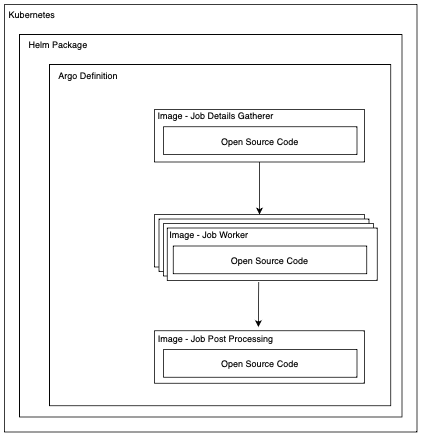

## Converter Project High Level Design

> **_NOTE:_**  This initial design is likely to be updated and refined as the converter projects progress in development, but ultimately we would like all converter projects to follow a similar design pattern for ease of use.

|  |
|:--:|
| *Figure 1 - FOCUS Project High Level Design* |

### Planned Design Elements
* [Terraform](https://www.terraform.io) - *Full stack deployment for those without K8s*
* [Kubernetes](https://kubernetes.io) - *Container Orchestration for Job exection*
* [Helm](https://helm.sh) - *Kubernetes package for deployment onto K8s*
* [Argo](https://argoproj.github.io/argo-workflows/) - *Job Workflow Definition*
* [Images](https://www.docker.com) - *Packaged code into a container image for deployment*
* Code - *The open source code of this project*
* Conversion Rules - *Programic definitions of the translation process*

In order to adhere to the principle of modular design each layer in the design elements should not have a hard dependancy on the specific implementation of the layer below. By this we mean that you should not have to deploy your Kubernetes cluster using the provided terraform or your Helm package does not need to be deployed onto a specific Kubernetes implementation like (EKS, AKS, etc) and most importantly there would be nothing stopping someone from using the provided source code in their own deployment architecture.

In this first cut design for the converter projects we have three main stages:

The first stage is to assess what needs to be converted and to slice this work up into parts that can be parallel executed. An example of this would be individual files for a file based converter or LIMIT/OFFSETs for a SQL based datastore.

The second stage is a group of parallel executed jobs, each job takes part of the source data and applies the set of rules to convert the format of the input data into FOCUS compatible data.

The last step in the execution will be a post processing step that can join the parts of processed data, load into an output datastore and initialise partitions, etc.

The code based loaded into each of these steps will be the same code, but different entrypoints will be supported allowing the different modes of opperations.

If an individual converter project needs to widely deviate from this planned structure then the members of that project should first get community understanding and agreement with the plan before progressing.

## Conversions

The ideal structure for the conversion process is to have a set of supported conversions and a set of rules that apply to the source data in order to complete the conversion into the FOCUS format. The supported conversions will include items such as:

| Conversion Type          | Source           | Destination           | Conditionals  | Description                                                              |
|:-------------------------|:-----------------|:----------------------|:--------------|:-------------------------------------------------------------------------|
| Rename                   | Source Dimension | Destination Dimension | N/A           | Rename existing column to name of dimension in FOCUS Spec                |
| Conditional Copy         | Source Dimension | Destination Dimension | Condition Set | Conditionally copy contents of source dimension to destination column    |
| Static Value w/Condition | Source Dimension | Destination Dimension | Condition Set | Conditionally set dimension to static value                              |
| Delete                   | Source Dimension | N/A                   | N/A           | Delete dimemsion                                                         |
| Translation              | Source Dimension | Destination Dimension | Translation   | Translate the value from source dimension to destination                 |
| Mapping                  | Source Dimension | Destination Dimension | Mapping       | Use source dimension as a key to a mapping lookup, store value in destination|

Rules will ideally be stored in a programmically consumable format like YAML and will describe the individual conversions that need to be applied to the source data and the order they must be applied.

