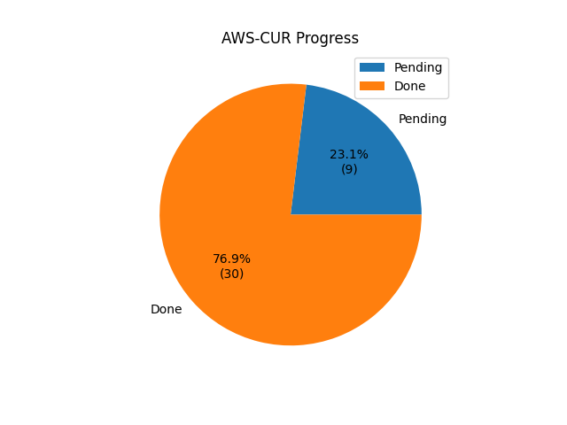
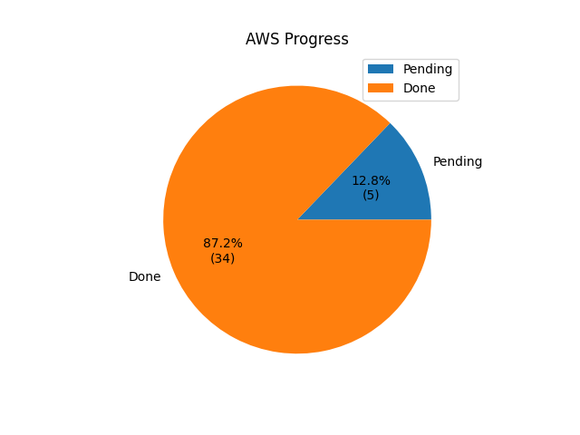
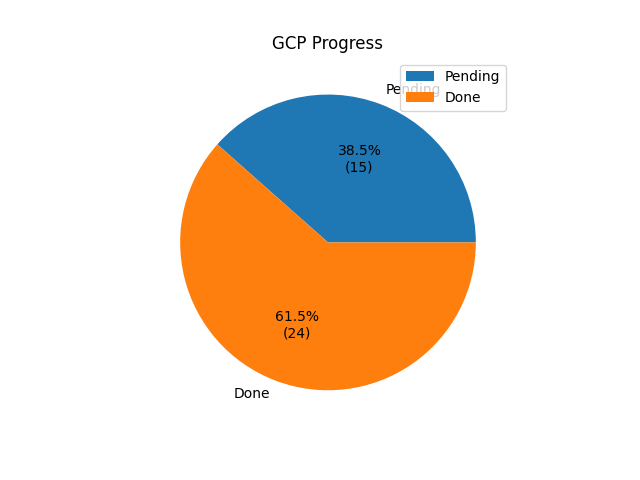
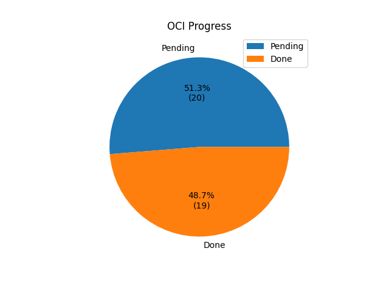

## Progress per provider
---

This represents only this projects progress in covering each providers with the FOCUS columns and requirements. Please check if your provider has native support for FOCUS and preference using their native support over this converter.

#### AWS Parquet

---

#### AWS CSV

---

#### Google Cloud

Information about native support can be found here: https://cloud.google.com/blog/topics/cost-management/new-bigquery-cloud-billing-view-based-on-focus

---

#### Microsoft Azure

Information about native support can be found here: https://azure.microsoft.com/en-us/blog/focus-a-new-specification-for-cloud-cost-transparency/

---

#### Oracle Cloud

Information about native support can be found here: https://blogs.oracle.com/cloud-infrastructure/post/announcing-focus-support-for-oci-cost-reports
